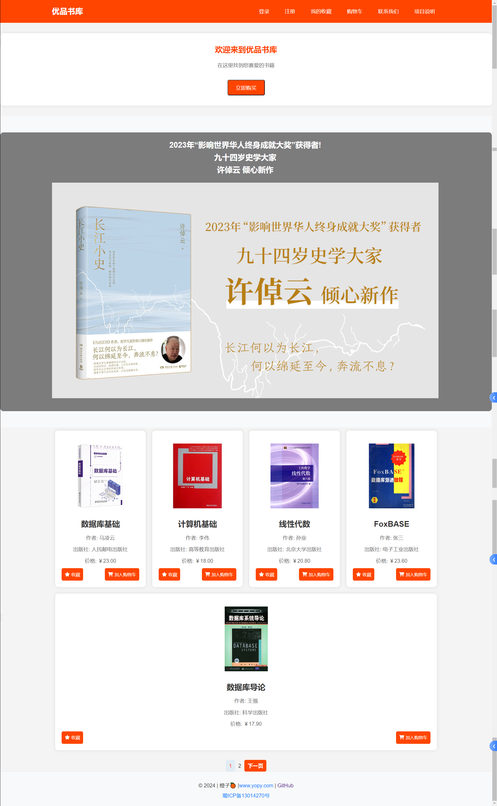
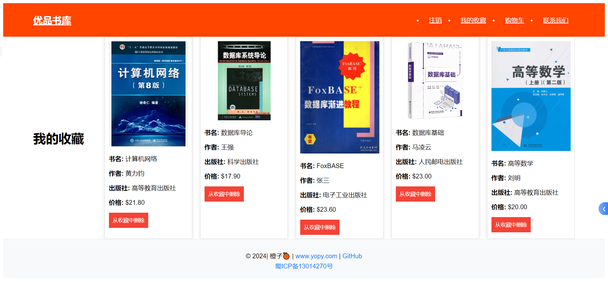
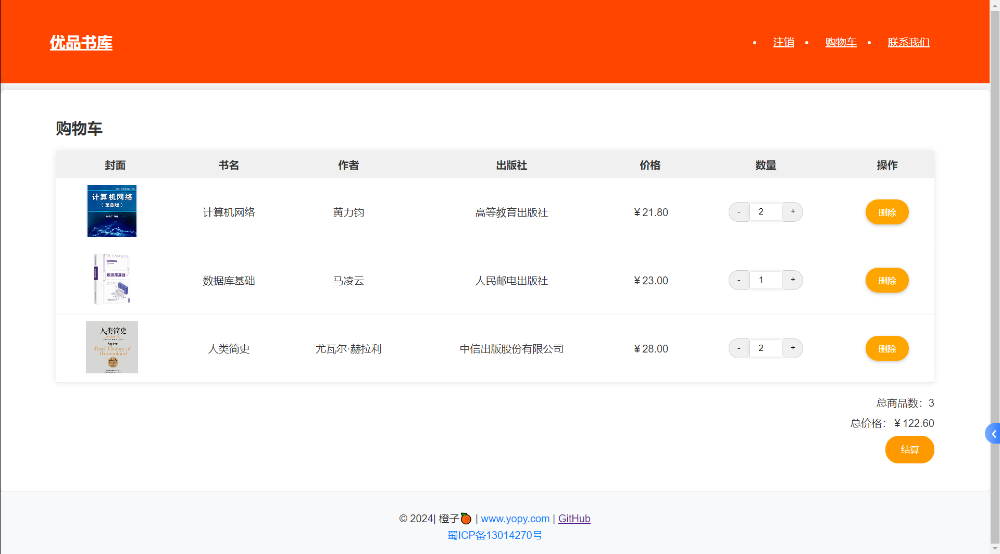
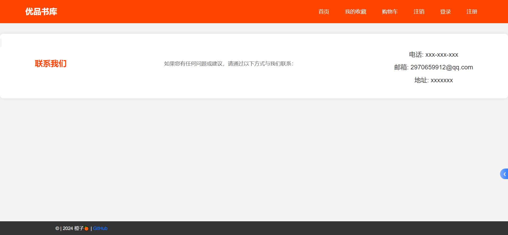

# **优品书库**

### 项目描述

优品书库是一个基于PHP和MySQL开发的简易书籍管理系统。它提供了用户登录、注册、浏览书籍列表、管理收藏夹和购物车的功能。

### 文件结构

项目包含以下文件和文件夹：

- **add_favorite.php**: 处理将书籍添加到收藏夹的请求。
- **book.php**: 展示随机书籍列表和将书籍添加到购物车的功能。
- **book_list.php**: 未提供详细信息。
- **cart.php**: 展示用户购物车中的书籍列表和管理功能。
- **contact.html**: 提供网站联系信息的静态页面。
- **css/**: 包含项目中各页面的样式文件。
- **db.php**: 包含数据库连接信息的文件。
- **favorites.php**: 展示用户收藏夹中的书籍列表和管理功能。
- **images/**: 存放项目中使用的书籍封面等图片资源。
- **index.php**: 项目的主页，包含书籍列表和基本功能链接。
- **login.html**: 用户登录页面。
- **login.php**: 处理用户登录验证和跳转逻辑。
- **logout.php**: 处理用户退出登录的逻辑。
- **register.html**: 用户注册页面。
- **register.php**: 处理用户注册功能和数据库插入操作。
- **remove_favorite.php**: 处理从收藏夹中移除书籍的请求。
- **remove_from_cart.php**: 处理从购物车中移除书籍的请求。

### 使用说明

1. **登录和注册**:
   - 访问 `login.html` 页面进行登录，或者通过 `register.html` 注册新用户。

2. **浏览书籍**:
   - 在 `index.php` 页面浏览随机书籍列表，点击书籍封面可以查看详情或将书籍添加到购物车。

3. **管理收藏夹**:
   - 登录后访问 `favorites.php` 可以查看和管理收藏夹中的书籍。

4. **管理购物车**:
   - 登录后访问 `cart.php` 可以查看和管理购物车中的书籍。

5. **联系我们**:
   - 点击网站顶部导航栏中的“联系我们”链接，访问 `contact.html` 页面查看联系信息。

### 技术栈

- **工具**:Vscode/XAMPP  V3.3.0

- **环境**:Apache

- **前端**: HTML, CSS
- **后端**: PHP
- **数据库**: MySQL

### 作者

本项目由 [橙子🍊] 独立开发。
登录账号 : admin/admin@qq.com
登录密码: admin

### 注意事项

请确保您的环境支持 PHP 和 MySQL，并且已正确配置数据库连接信息（详见 `db.php` 文件）。

### 数据库

```php
// 数据库连接参数
$host = 'localhost'; // 数据库主机
$db = 'book'; // 数据库名称
$user = 'root'; // 数据库用户名
$pass = '123456789'; // 数据库密码
$charset = 'utf8mb4'; // 字符集
```

### 修改密码

### 1. 使用命令行工具更改MySQL密码

1. 打开终端或命令提示符。
2. 登录到MySQL服务器：
   ```bash
   mysql -u root -p
   ```
   输入当前的密码后按回车。

3. 更改密码：
   ```sql
   ALTER USER 'root'@'localhost' IDENTIFIED BY '新密码';
   ```
   将`'新密码'`替换为您想要设置的新密码。

4. 刷新权限：
   ```sql
   FLUSH PRIVILEGES;
   ```

### 2. 使用phpMyAdmin更改MySQL密码

如使用的是phpMyAdmin，可以按照以下步骤进行修改：

1. 登录phpMyAdmin。
2. 选择 `User accounts` 选项卡。
3. 找到您要修改密码的用户，并点击 `Edit privileges`。
4. 在编辑页面中，找到并点击 `Change password`。
5. 输入并确认新密码，然后点击 `Go` 保存更改。

### 3. 修改完成后，更新您的配置文件

在更改数据库密码后，更新应用程序配置文件， `db.php`，以确保应用程序使用新的密码连接数据库。

```php
<?php
// db.php
$host = 'localhost';
$db = 'book';
$user = 'root';
$pass = '新密码'; // 新密码
$charset = 'utf8mb4';

$dsn = "mysql:host=$host;dbname=$db;charset=$charset";
$options = [
    PDO::ATTR_ERRMODE => PDO::ERRMODE_EXCEPTION,
    PDO::ATTR_DEFAULT_FETCH_MODE => PDO::FETCH_ASSOC,
    PDO::ATTR_EMULATE_PREPARES => false,
];

try {
    $pdo = new PDO($dsn, $user, $pass, $options);
} catch (\PDOException $e) {
    throw new \PDOException($e->getMessage(), (int)$e->getCode());
}
?>
```

### 图片示例









